> **System Architect | AI Orchestrator**
> "Automating the impossible, orchestrating the future."

###  Global Leaderboard

### Real-Time Enterprise Metrics

###  Technical Arsenal

---

### Enterprise Grade Ecosystems

* **Cyberpop AI Git CLI:** Designed and developed a secure, local-first AI-powered Git automation tool. Incorporates zero-knowledge hardware-bound AES-256-GCM encryption, RAM volatile memory sanitization, proxy tampering resistance, and optimized PyArmor obfuscation to protect API credentials in hostile developer environments.
* **Blender AI Automation Bridge:** Engineered a fully headless automated 3D rendering pipeline integrating Tripo AI text-to-3D generation with programmatic Blender execution. 
* **NovaTok Enterprise Prototype:** Architected a highly scalable short-form video delivery platform utilizing advanced DOM Recycling techniques.
* **Wuthering Waves Global Infrastructure:** Deployed high-concurrency analytical tools and real-time data synchronization platforms.
* **Nova Asynchronous Automator:** Developed an event-driven cybernetic Discord bot featuring autonomous economy engines.
